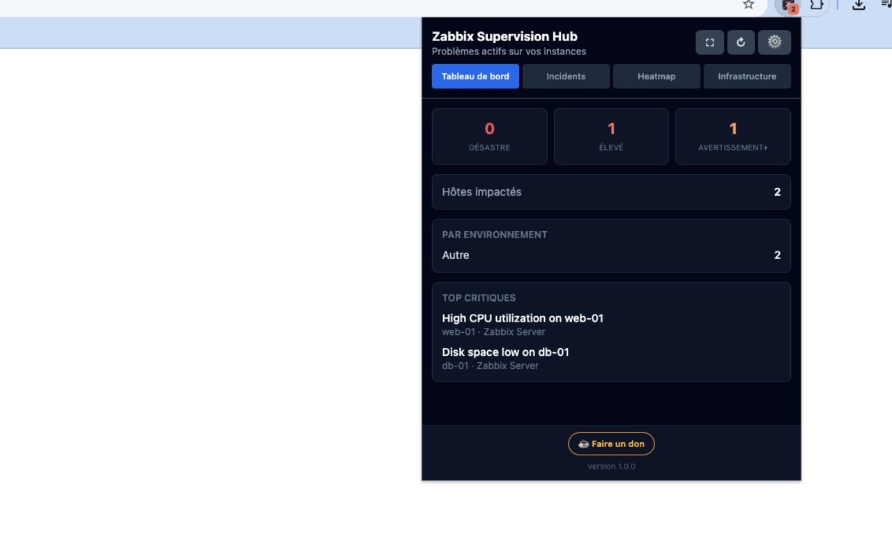
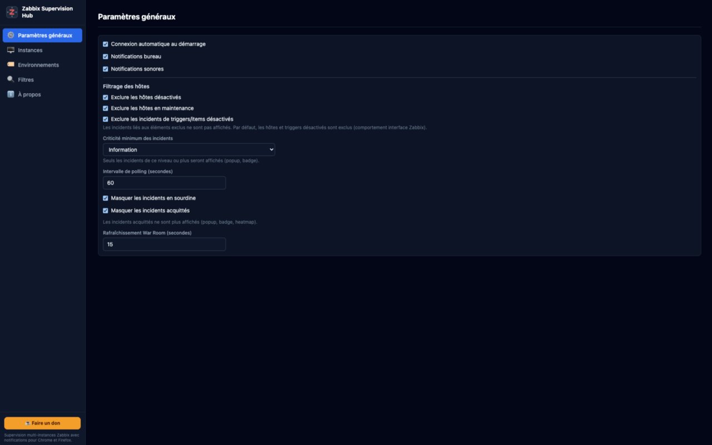
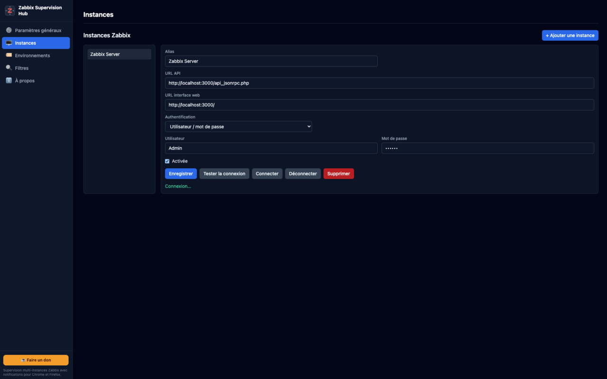
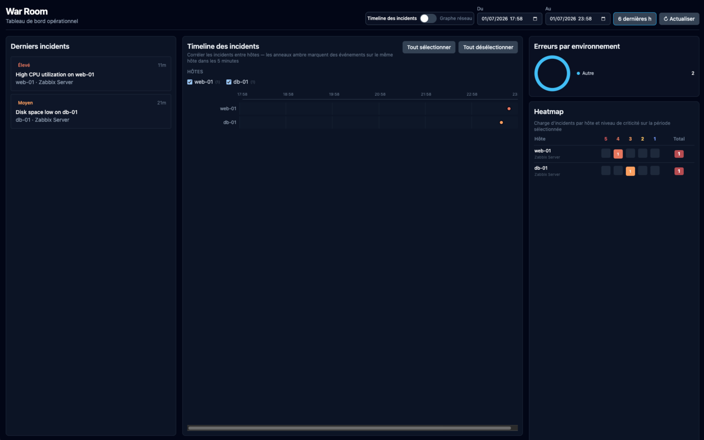

# Zabbix Supervision Hub

Multi-instance Zabbix monitoring browser extension for **Chrome** and **Firefox** (Manifest V3).

**v1.0.0** — configurable environments, title/host/trigger filters, War Room correlation dashboard, severity-based alarm sounds, snooze, heatmap, infrastructure view, and 15 languages.

## Captures d’écran

| Popup | Options — Général |
| ----- | ----------------- |
|  |  |

| Options — servers | War room |
| ---------------- | -------------------- |
|  |  |

## Features

- **4-tab popup**: Dashboard, Problems, Heatmap, Infrastructure
- **War Room**: incident list, correlation timeline, heatmap
- **Problem grouping**: correlate similar triggers across hosts (Web Worker)
- **Host timeline**: recent events + quick acknowledge
- **Snooze** — mute notifications for 30 min / 1 h / 4 h
- **Configurable environments** — custom labels + host group mapping
- **Severity alarm sounds** — MP3 per Zabbix severity level
- **15 languages**: en, fr, de, es, it, pt, pt_BR, nl, pl, ru, ja, ko, zh_CN, sr, tr

## Stack

- Vite + Vue 3 + TypeScript
- Tailwind CSS
- TanStack Query (popup / War Room data)
- Dexie (problems/hosts cache + snooze)
- Manifest V3 (Chrome service worker + Firefox background script)


## Development

```bash
npm install
npm run dev:chrome    # watch build for Chrome
npm run dev:firefox   # watch build for Firefox
npm test
npm run build         # production build + release zips in release/
```

Load unpacked from `dist/chrome` or `dist/firefox`.

### Mock Zabbix server

```bash
node mock-server/server.cjs
```

## Project layout

```
src/
  background/       # MV3 worker + audio + RPC security
  popup/            # Main UI (Vue)
  options/          # Settings page
  warroom/          # Fullscreen ops dashboard
  offscreen/        # Chrome audio playback
  modules/          # Controller, services, API client
  workers/          # Correlation Web Worker
  _locales/         # i18n (15 languages)
public/skin/        # Icons + alarm sounds
scripts/            # Release packaging
```

## Release

```bash
npm run build
# → release/zabbix-supervision-hub-1.0.0-chrome.zip
# → release/zabbix-supervision-hub-1.0.0-firefox.zip
```

## Licence

Voir [src/license.txt](public/license.txt).
